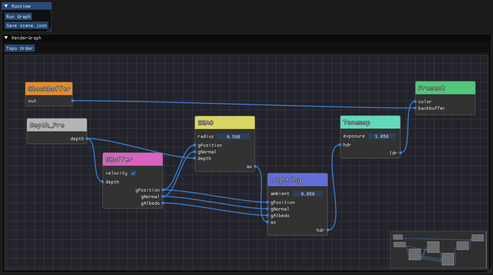

# vrendergraph

`vrendergraph` is a tiny **data-driven render pipeline** layer that builds a runtime FrameGraph from JSON.

<p align="center">
    <a href="https://github.com/zzxzzk115/vrendergraph/releases/latest" alt="Latest Release">
        </a>
    <a href="https://github.com/zzxzzk115/vrendergraph/actions" alt="Build-Windows">
        </a>
    <a href="https://github.com/zzxzzk115/vrendergraph/actions" alt="Build-Linux">
        </a>
    <a href="https://github.com/zzxzzk115/vrendergraph/actions" alt="Build-macOS">
        </a>
    <a href="https://github.com/zzxzzk115/vrendergraph/issues" alt="GitHub Issues">
        </a>
    <a href="https://www.codefactor.io/repository/github/zzxzzk115/vrendergraph"></a>
    <a href="https://github.com/zzxzzk115/vrendergraph/blob/master/LICENSE" alt="GitHub">
        </a>
</p>



Goals:

- Keep the runtime builder minimal and deterministic (execute passes in `passes[]` order).
- Pass IO is described via `inputs` / `outputs` slot maps.
- Optional `meta` field stores **editor/tool UI state** (node positions, zoom/pan, etc.) and is ignored by runtime.

## JSON format

```json
{
  "resources": ["backbuffer"],
  "passes": [
    {
      "enabled": true,
      "id": "Depth_Pre",
      "outputs": {
        "depth": "Depth_Pre.depth"
      },
      "type": "Depth_Pre"
    },
    {
      "enabled": true,
      "id": "GBuffer",
      "inputs": {
        "depth": "Depth_Pre.depth"
      },
      "outputs": {
        "gbuffer": "GBuffer.gbuffer"
      },
      "type": "GBuffer"
    },
    {
      "enabled": true,
      "id": "Lighting",
      "inputs": {
        "gbuffer": "GBuffer.gbuffer"
      },
      "outputs": {
        "hdr": "Lighting.hdr"
      },
      "type": "Lighting"
    },
    {
      "enabled": true,
      "id": "Tonemap",
      "inputs": {
        "hdr": "Lighting.hdr"
      },
      "outputs": {
        "ldr": "Tonemap.ldr"
      },
      "type": "Tonemap"
    },
    {
      "enabled": true,
      "id": "Present",
      "inputs": {
        "backbuffer": "backbuffer",
        "color": "Tonemap.ldr"
      },
      "type": "Present"
    }
  ],
  "meta": {
    "editor": {
      "view": { "zoom": 1.0, "pan": [0.0, 0.0] },
      "nodes": {
        "Depth_Pre": { "pos": [-300.0, 0.0] }
        // ...
      }
    }
  }
}
```

Notes:

- `passes[]` is required.
- `resources[]` can be empty.
- `meta{}` is optional and intended for tools.

## Documentation

- [Runtime Integration](./docs/RUNTIME.md)
- [Editor Integration](./docs/EDITOR.md)

## Editor helper header

`vrendergraph_editor.hpp` provides header-only helpers to read/write editor UI state
into `RenderGraphDesc::meta`.

`imgui.h` and `imgui_node_editor.h` are needed.

## License

This project is under the [MIT](./LICENSE) license.
